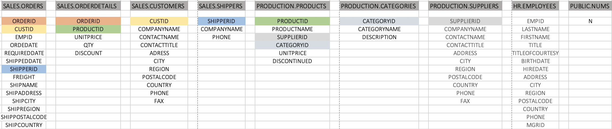
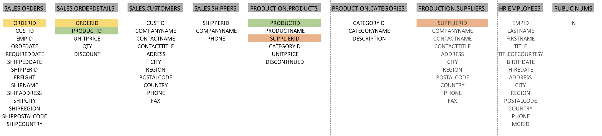
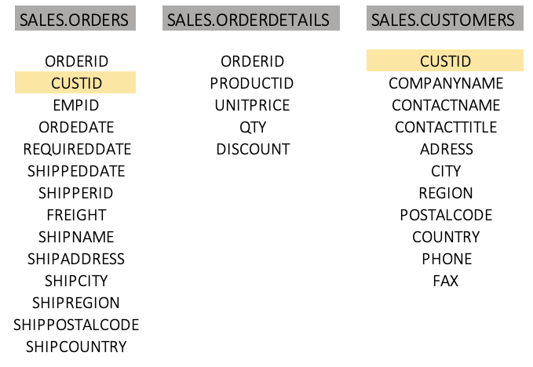
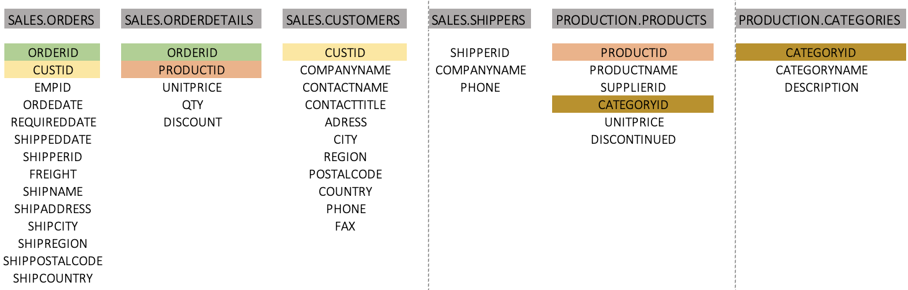

```{r setup, include=FALSE}
knitr::opts_chunk$set(echo = TRUE)
```

***
# VIZUALIZACIJA TABEL ZA LAŽJE DELO


***

# 1. NALOGA
```{r uvoz, echo=FALSE, message=FALSE, warning=FALSE,  results='hide'}
source("uvoz/uvoz.r", encoding="UTF-8")
```
a.) Izpis bruto prodaje za leto 2015 za vse dobavitelje (production.suppliers > companyname) \
       companyname | gross_sales \


```SQL:
SELECT PRODUCTION.SUPPLIERS.COMPANYNAME, SUM(SALES.ORDERDETAILS.UNITPRICE*SALES.ORDERDETAILS.QTY) AS GROSS_SALES FROM SALES.ORDERS
INNER JOIN SALES.ORDERDETAILS ON SALES.ORDERS.ORDERID=SALES.ORDERDETAILS.ORDERID
INNER JOIN PRODUCTION.PRODUCTS ON SALES.ORDERDETAILS.PRODUCTID=PRODUCTION.PRODUCTS.PRODUCTID
INNER JOIN PRODUCTION.SUPPLIERS ON PRODUCTION.PRODUCTS.SUPPLIERID=PRODUCTION.SUPPLIERS.SUPPLIERID
WHERE ORDERDATE BETWEEN '2015-01-01' AND '2015-12-31'
GROUP BY PRODUCTION.SUPPLIERS.COMPANYNAME;
```
Izpisana tabela:
```{r echo=FALSE, message=FALSE, warning=FALSE}
library(knitr)
kable(a1)
```

b.) Razširi izpis z dodatnim stolpcem, ki predstavlja spremembo prodaje glede na leto 2014 \
       companyname | gross_sales | abs_change \
```SQL:
CREATE TABLE BRUTO_PRODAJA_2015 AS 
SELECT PRODUCTION.SUPPLIERS.COMPANYNAME, SUM(SALES.ORDERDETAILS.UNITPRICE*SALES.ORDERDETAILS.QTY) AS GROSS_SALES FROM SALES.ORDERS
INNER JOIN SALES.ORDERDETAILS ON SALES.ORDERS.ORDERID=SALES.ORDERDETAILS.ORDERID
INNER JOIN PRODUCTION.PRODUCTS ON SALES.ORDERDETAILS.PRODUCTID=PRODUCTION.PRODUCTS.PRODUCTID
INNER JOIN PRODUCTION.SUPPLIERS ON PRODUCTION.PRODUCTS.SUPPLIERID=PRODUCTION.SUPPLIERS.SUPPLIERID
WHERE ORDERDATE BETWEEN '2015-01-01' AND '2015-12-31'
GROUP BY PRODUCTION.SUPPLIERS.COMPANYNAME;
```

```SQL:
CREATE TABLE BRUTO_PRODAJA_2014 AS 
SELECT PRODUCTION.SUPPLIERS.COMPANYNAME, SUM(SALES.ORDERDETAILS.UNITPRICE*SALES.ORDERDETAILS.QTY) AS GROSS_SALES_2014 FROM SALES.ORDERS
INNER JOIN SALES.ORDERDETAILS ON SALES.ORDERS.ORDERID=SALES.ORDERDETAILS.ORDERID
INNER JOIN PRODUCTION.PRODUCTS ON SALES.ORDERDETAILS.PRODUCTID=PRODUCTION.PRODUCTS.PRODUCTID
INNER JOIN PRODUCTION.SUPPLIERS ON PRODUCTION.PRODUCTS.SUPPLIERID=PRODUCTION.SUPPLIERS.SUPPLIERID
WHERE ORDERDATE BETWEEN '2014-01-01' AND '2014-12-31'
GROUP BY PRODUCTION.SUPPLIERS.COMPANYNAME;
```

```SQL:
CREATE TABLE BRUTO_PRODAJA AS
SELECT PUBLIC.BRUTO_PRODAJA_2014.COMPANYNAME, SUM(PUBLIC.BRUTO_PRODAJA_2015.GROSS_SALES-GROSS_SALES_2014) AS ABS_CHANGE FROM PUBLIC.BRUTO_PRODAJA_2014
INNER JOIN PUBLIC.BRUTO_PRODAJA_2015 ON PUBLIC.BRUTO_PRODAJA_2014.COMPANYNAME=PUBLIC.BRUTO_PRODAJA_2015.COMPANYNAME
GROUP BY PUBLIC.BRUTO_PRODAJA_2014.COMPANYNAME;
```

```SQL:
SELECT PUBLIC.BRUTO_PRODAJA.COMPANYNAME, PUBLIC.BRUTO_PRODAJA_2015.GROSS_SALES, ABS_CHANGE FROM PUBLIC.BRUTO_PRODAJA
JOIN PUBLIC.BRUTO_PRODAJA_2015 ON PUBLIC.BRUTO_PRODAJA.COMPANYNAME=PUBLIC.BRUTO_PRODAJA_2015.COMPANYNAME;
```

Izpisana tabela:
```{r echo=FALSE, message=FALSE, warning=FALSE}
library(knitr)
kable(b1)
```

c.) Omeji izpis s samo tistimi dobavitelji, ki so imeli več kot +10k razlike v prodaji \
```SQL:
SELECT PUBLIC.BRUTO_PRODAJA_2014.COMPANYNAME, SUM(PUBLIC.BRUTO_PRODAJA_2015.GROSS_SALES-GROSS_SALES_2014) AS ABS_CHANGE FROM PUBLIC.BRUTO_PRODAJA_2014
INNER JOIN PUBLIC.BRUTO_PRODAJA_2015 ON PUBLIC.BRUTO_PRODAJA_2014.COMPANYNAME=PUBLIC.BRUTO_PRODAJA_2015.COMPANYNAME
GROUP BY PUBLIC.BRUTO_PRODAJA_2014.COMPANYNAME
HAVING ABS_CHANGE > 10000;
```
Izpisana tabela:
```{r echo=FALSE, message=FALSE, warning=FALSE}
library(knitr)
kable(c1)
```

d.) Vzami rezultat iz točke a.) in dodaj novi koloni - mesec in YTD gross revenue \

***

# 2. NALOGA
a.) Izpiši celotno prodajo po letih za top 10 kupcev v letu 2014 za kategorijo "Beverages", ki so opravili vsaj 5 nakupov (production.categories -> categoryname) \
       companyname (sales.customers) | year | gross_sales \

Število naročil za določen customers, ki je opravil vsaj 5 nakupov:

```SQL:
SELECT COMPANYNAME, EXTRACT(YEAR FROM SALES.ORDERS.ORDERDATE) AS YEAR, COUNT(SALES.ORDERS.ORDERID) AS GROSS_SALES FROM SALES.CUSTOMERS
INNER JOIN SALES.ORDERS ON SALES.CUSTOMERS.CUSTID=SALES.ORDERS.CUSTID
GROUP BY SALES.CUSTOMERS.COMPANYNAME, YEAR
HAVING GROSS_SALES >= 5;
```
Izpisana tabela:
```{r echo=FALSE, message=FALSE, warning=FALSE}
library(knitr)
kable(a21)
```

Top 10 kupcev v letu 2014:

```SQL:
SELECT SALES.CUSTOMERS.COMPANYNAME, COUNT(SALES.ORDERS.ORDERID) AS GROSS_SALES FROM SALES.ORDERS
INNER JOIN SALES.CUSTOMERS ON SALES.ORDERS.CUSTID=SALES.CUSTOMERS.CUSTID
INNER JOIN SALES.ORDERDETAILS ON SALES.ORDERS.ORDERID=SALES.ORDERDETAILS.ORDERID
INNER JOIN PRODUCTION.PRODUCTS ON SALES.ORDERDETAILS.PRODUCTID=PRODUCTION.PRODUCTS.PRODUCTID
INNER JOIN PRODUCTION.CATEGORIES ON PRODUCTION.PRODUCTS.CATEGORYID=PRODUCTION.CATEGORIES.CATEGORYID
WHERE ORDERDATE BETWEEN '2014-01-01' AND '2014-12-31'AND PRODUCTION.CATEGORIES.CATEGORYID=1
GROUP BY SALES.CUSTOMERS.COMPANYNAME
ORDER BY  GROSS_SALES DESC
LIMIT 10;
```

Izpisana tabela:
```{r echo=FALSE, message=FALSE, warning=FALSE}
library(knitr)
kable(a22)
```

b.) Izpiši kakšen delež predstavlja teh 10 kupcev po letih v celotni prodaji \
      skupina (vrednosti top10 in ostalo) | year | delež \
*glede na to, da imamo 3 leta podatkov, mora imeti rezultat 6 vrstic

***

# 3. NALOGA
Izpiši za vsakega kupca koliko nakupov je v določenem razredu "trajanja med dvema nakupoma" \
   Torej če je stranka opravila nakup 1.1.2020 in naslednji nakup 20.1.2020 pomeni, da je bilo med nakupoma 20 dni \
   - štejemo samo tiste, ki so imeli vsaj 2 nakupa \
   - predefinirani razredi - do 10 dni, med 11 in 50 dni, med 51 in 100 dni, več \
   Izpis oblike: \
      companyname (sales.customers) | do_10 | 11-50 | 51-100| več

```SQL:
SELECT SALES.CUSTOMERS.COMPANYNAME,COUNT(ORDERID) AS DO_10 FROM SALES.ORDERS
INNER JOIN SALES.CUSTOMERS ON SALES.ORDERS.CUSTID=SALES.CUSTOMERS.CUSTID
WHERE DATEDIFF(DAY, ORDERDATE, ORDERDATE) < 10
GROUP BY SALES.CUSTOMERS.COMPANYNAME
HAVING DO_10 >= 2;
```   
Izpisana tabela:
```{r echo=FALSE, message=FALSE, warning=FALSE}
library(knitr)
kable(a3)
```
***

